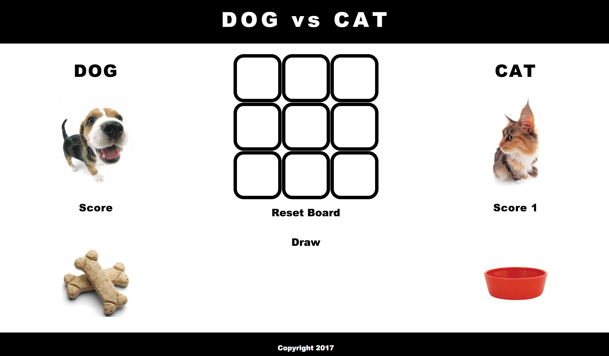

# Tic Tac Toe

## Description

The project aims to showcase the use of HTML, CSS, javascript and jQuery in creating a game of Tic Tac Toe.

## Features

To make the game more interactive, I introduced the following features:

- The player can choose which image (dog or cat) he or she prefers.

- Instead of the classic X and O, images of the dog food and cat bowl were used instead.

- When a player wins, the borders of the winning cells become red, the "winner" message appears below the winning player, a score is recorded, and the animal sound of the winning player appears below the board. If neither player wins, a score for draw is recorded and the message "Nobody wins!" appears below the board.

## Result
Here is [my live site](http://jonathansee2013.github.io/tictactoe/)

## Wish List

While I am satisfied with the result, I would have wanted to add sounds where the winning player barks or meows. It would have been better also if the winning cells blink (or fades in and out). Lastly I would prefer displaying a translucent message on the dog or cat image, as the case may be, which informs the player to click the image to choose preferred dog or cat, as the case may be.  

## Acknowledgments

I would like to thank Luke Hammer first and foremost for being patient and guiding me in this project without radically changing my codes. Also a message of thanks to Matty for answering all my queries and to everyone in class who inspired me to constantly improve the project. Lastly the images of the dogs and cats were taken from [www.thedogandfriends.com](http://thedogandfriends.com).
